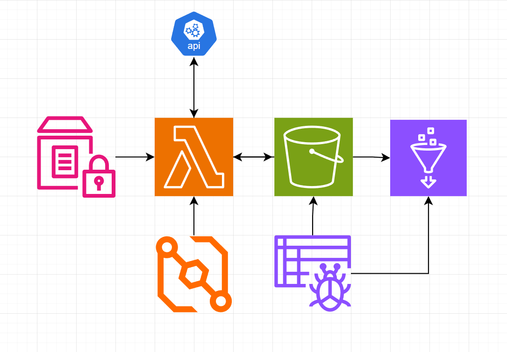

# AWS Serverless Weather Data Pipeline (ETL)

## 📌 Project Overview
This project implements an end-to-end serverless ETL (Extract, Transform, Load) pipeline on AWS to automate the collection, storage, and analysis of real-time weather data for Toledo, Ohio. The system is designed to be cost-effective and scalable, handling real-world data engineering challenges such as **Schema Evolution** and **Data Localization**.

## 🏗️ Architecture
The pipeline architecture leverages the following AWS services:
* **Data Ingestion**: An **AWS Lambda** function triggered by **Amazon EventBridge** every hour to fetch data from the OpenWeather API.
* **Security**: API credentials and sensitive configurations are managed securely using **AWS SSM Parameter Store**.
* **Data Lake**: Raw JSON data is stored in **Amazon S3** using **Hive-style partitioning** (`year/month/day`) to optimize query performance and reduce costs.
* **Data Cataloging**: **AWS Glue Crawlers** automatically scan S3 buckets to manage the metadata catalog and handle **Schema Evolution**.
* **Analytics**: **Amazon Athena** is used to perform SQL-based transformations, including unit conversions and timezone adjustments.



## 🚀 Key Features
* **Automated Partitioning**: Implemented a folder structure in S3 that allows Athena to skip unnecessary data, significantly lowering data scan costs.
* **Schema Resilience**: Successfully managed data type consistency using the Glue Data Catalog to handle inconsistent API responses (e.g., Integer to Double conversion for wind metrics).
* **Data Transformation**: Engineered a SQL View to provide human-readable metrics:
    * Converted temperatures from **Fahrenheit to Celsius**.
    * Localized observation times from **UTC to Eastern Standard Time (EST)**.
    * Flattened complex nested JSON structures for efficient querying.

## 🛠️ Tech Stack
* **Cloud**: AWS (Lambda, S3, Glue, Athena, EventBridge, SSM).
* **Languages**: Python (Boto3), SQL (Advanced).
* **Data Format**: JSON.

## 📊 Sample Analytics Query
To retrieve and view the processed data, you can query the established Athena View:

```sql
SELECT 
    city, 
    temp_f, 
    temp_c, 
    toledo_time, 
    sky_condition 
FROM v_toledo_weather_report 
ORDER BY toledo_time DESC 
LIMIT 10;